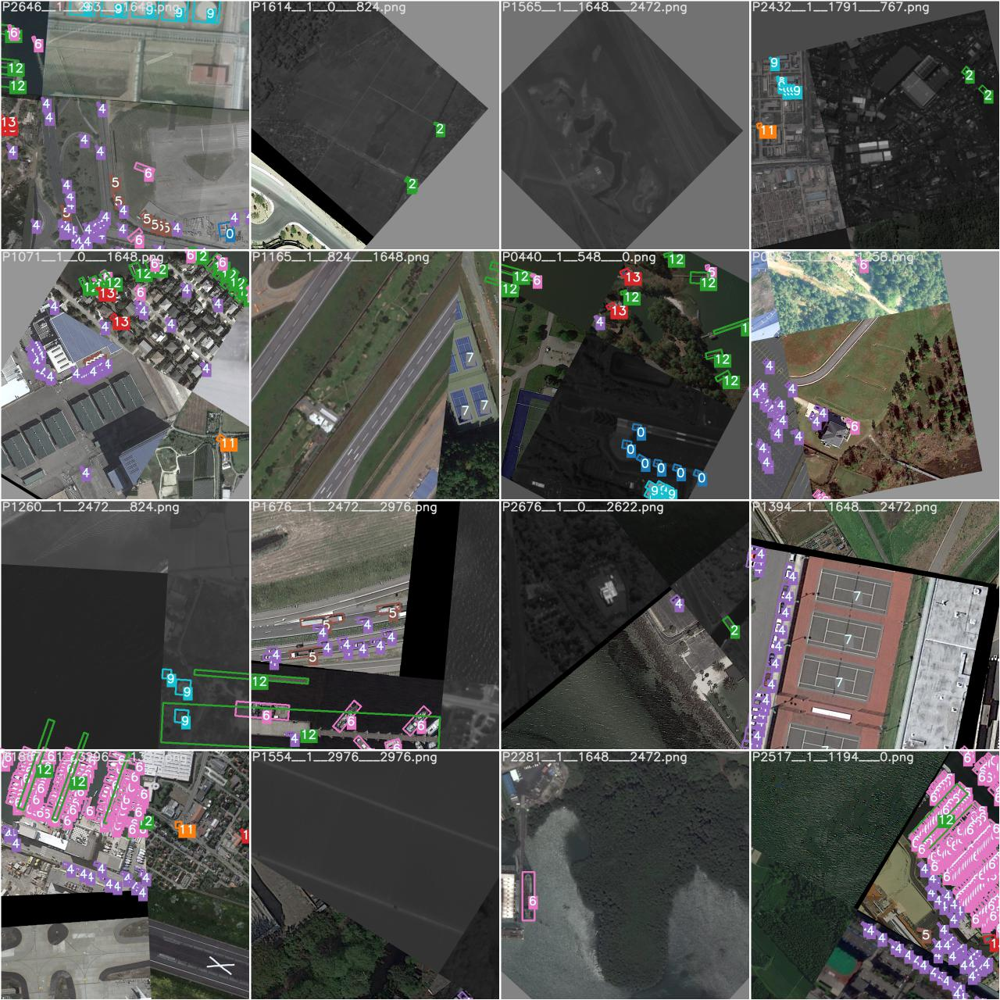
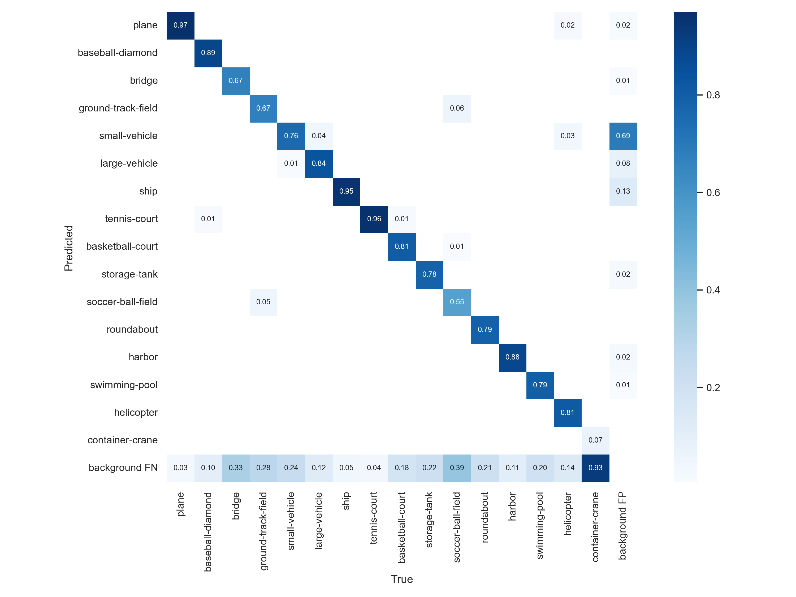
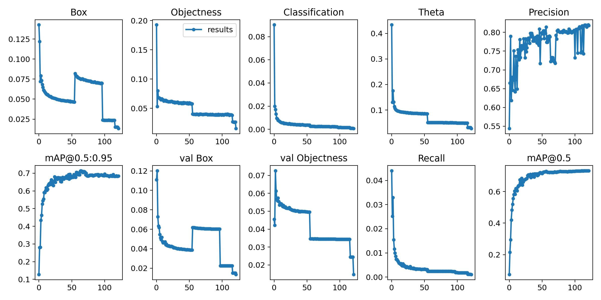

# YOLOv7 for Oriented Object Detection

    

    

    

    

Implementation of [YOLOv7](https://arxiv.org/abs/2207.02696), [Circular Smooth Label](https://arxiv.org/abs/2003.05597v2) and [YOLOv5-OBB](https://github.com/hukaixuan19970627/yolov5_obb) as part of the final graduation project at [Federal University of Santa Maria, Brazil](https://www.ufsm.br/) 

## Performance 

The results on DOTA_subsize1024_gap200_rate1.0 test-dev set are shown in the table below.

 |Model (download link) |Size (pixels) | TTA (multi-scale/ rotate testing) | OBB mAPtest 0.5 DOTAv1.5 | Speed T4 b8 (ms) |params (M) |FLOPs @1024 (B) 
 | ----                                                                                                                                                           | ---  | ---   | ---   | --- | --- | ---
 |yolov7 [[google](https://drive.google.com/file/d/10zxuTON_1XxZ3SKzjZaWPdwrV0SF26ed/view?usp=sharing)]  |1024  | ×     |**77.9**      |**37.6**      |**37.5**   |**106.5**

## Installation

Please refer to [install.md](./docs/install.md) for installation and dataset preparation.

## Getting Started 

This repo is based on [YOLOv7](https://arxiv.org/abs/2207.02696). Please refer to [getStarted.md](./docs/getStarted.md) for the basic usage.

## Re-parameterization

See [reparameterization.ipynb](tools/reparameterization.ipynb)

## Acknowledgements

 <b>Expand</b> 

* [YOLOv5](https://github.com/ultralytics/yolov5)
* [YOLOv7](https://arxiv.org/abs/2207.02696)
* [Circular Smooth Label](https://arxiv.org/abs/2003.05597v2)
* [YOLOv5-OBB](https://github.com/hukaixuan19970627/yolov5_obb)
* [CAPTAIN-WHU/DOTA_devkit](https://github.com/CAPTAIN-WHU/DOTA_devkit)

